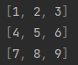
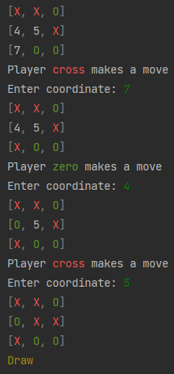

# Command tic-tac-toe
## Description:
It's command version of tic-tac-toe with pretty colored print. The table, players, commas and result are colored.

Initially user have table 
with coordinates from one to desk size _(include)_. And user can enter coordinate, 
where he wants go. After selecting a coordinate, a cross or zero takes its place 
**Example**:

   Initially:   
   _Some time later.._ 
      

### Command line parameters
Since the project is on the command line, it has some command line parameters: 
(parameters in unix style)
- `-h` or `--help`: return help message
- `-ds` or `--desk-size`: configure desk size
- `-p` or `--player`: identify player, who will go first

### Some other information
Program work on Windows, Unix, macOS and Linux. Necessary Python is 3.9+
